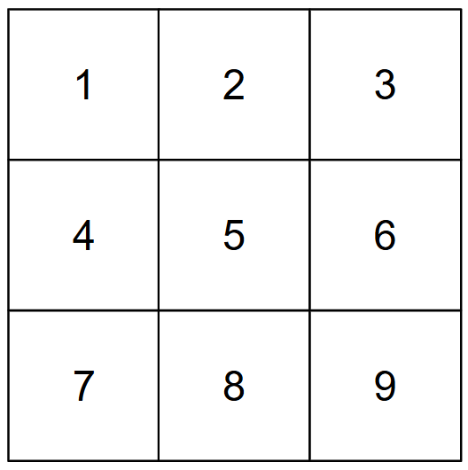

# Project: Sudoku Game

This project is my first independent project with [boot.dev](https://www.boot.dev/tracks/backend). With this project, I am aiming to implement a playable & solvable game of Sudoku from scratch. Specific goals are:

- [X] Learn to use Argparse
- [X] Implement UI that performs backtracking algorithm to solve a puzzle
- [X] Create a function that can initialize a unique, solvable sudoku board
- [X] Implement game playable from command line
- [ ] Implement game playable from GUI
- [ ] Learn about unittest.mock and user inputs

## Description

Rows, columns, and boxes hve indices from 1-9. A diagram illustrating box indexing convention is shown below.

## Usage

Run `python3 main.py` in the terminal. Use `-h` or `--help` to see the available options for playing the game. 

A valid sudoku grid will be generated, then some values will be taken away to make a grid with a unique solution. The chosen difficulty will determine the number of cells that are empty (It might take a little longer to generate expert games!)

If you choose to play the game, use the format `(row,col = val)` to input values. Indices must be between 1-9.

TODO: GUI game mode

## Testing

Run `python3 -m unittest discover` in the terminal to perform all unit tests. (I've slacked on these a little bit...)

TODO: Update unit tests for `play_game` module

## Bugs

Below is a list of discovered bugs. If they have been checked off, they have been addressed.

- [X] If a user opts to play, then places one or more valid values in the grid, then elects to automatically solve the puzzle, sometimes the solver may not work. It will solve part of the puzzle and an already filled value will be changed seemingly randomly, preventing the solution of the puzzle.